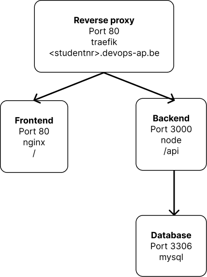

# Projectopdracht Oscar Alexander

Welkom bij de doorlopende projectopdracht van Oscar Alexander. Hier wordt uitgelegd hoe je het project opstelt en tot werken krijgt. Met dit project kan je een to-do applicatie opstellen. Er zijn twee onderdelen: Back-end en Front-end, met opties tot uitbereidingen met Traefik, Portainer, Jenkins, enz.

## Installatie

Om het project te clonen en op je eigen machine of server te krijgen, gebruik je: ```git clone https://github.com/AP-IT-GH/projectopdracht-canuski.git```

## Structuur

De file structuur zou er nu zo moeten uitzien, zorg dat je docker-compose.yml bestaat en de juist namen van directories bevat.
```
projectopdracht-canuski/
├── architectuur.png
├── backend/
│   ├── Dockerfile
│   ├── index.js
│   ├── package.json
│   ├── package-lock.json
│   ├── todo-inmemory.js
│   ├── todo-mysql.js
│   └── verify.js
├── docker-compose.yml
├── frontend/
│   └── static/
│       ├── index.html
│       ├── jquery.min.js
│       └── style.css
├── init.sql
└── README.md
```

## Backend installatie

Bekijk de docker-compose.yml file, waarin environment-variabelen worden gebruikt, hieronder staan de delen code die enviorment variabelen gebruiken. 
```
    environment:
      - STORAGE=mysql
      - MYSQL_HOST=db
      - MYSQL_USER=${DB_USER}
      - MYSQL_PWD=${DB_PASS}
      - MYSQL_DB=${DB} 
```
en
```
    environment:
      - MYSQL_ROOT_PASSWORD=${DB_ROOT}
      - MYSQL_USER=${DB_USER}
      - MYSQL_PASSWORD=${DB_PASS}
      - MYSQL_DATABASE=${DB}  
```
Om dit werkend te krijgen zal je een .env file moeten aanmaken. Maak deze file aan met ```touch .env``` voor linux. De .env gaat de bovenstaande enviorment variabelenen moeten bevatten. Dus; DB_ROOT, DB_USER, DB_PASS en DB. Zorgt dat er in de dockerfile zeker ```RUN npm install``` staat. De backend gaat op poort 3000 runnen. Andere versies van node kan je terug binden op hun offciele docker-hub pagina [https://hub.docker.com/_/node/].

### Database Configuratie
De .env file zou er als volgt kunnen uitzien:
```
DB_ROOT=DitIsGoed
DB_USER=DB_user
DB_PASS=DitIsGoed
DB=todo_list
```

## Frontend installatie
Bij de frontend valt er niet veel te installeren. In de index.html kan je de html van de pagina aanpassen om het een andere look te geven. Hetzelfde bij style.css.

Om de applicatie op te starten maak je gebruik van ```docker-compose up -d```. Om de applicatie neer te brengen maak je gebruik van ```docker-compose down```. 

## Database initialisatie
De sql.init inistaliseerd de database.
```
CREATE TABLE IF NOT EXISTS examen;
USE examen;
```
Deze lijnen code gebruik je voor de aanmaak van de database. Je bent vrij om hier een naam voor te kiezen. Verwijder zeker de sql.init file niet!

## Architectuur



## Overige uitbereiding
Dit project ondersteunt uitbreidingen zoals Traefik, Portainer, en een Jenkins-pipeline voor eenvoudige implementatie. Bekijk de documentatie op de respectievelijke websites voor installatie-instructies. Ik geef hieronder een kleine belichting hoe van traefik en jenkins eenvoudig gebruik te maken.

## Traefik
Traefik wordt gebruikt als een reverse proxy, waarvan de voornaamste functie is om op te treden als een load balancer. Een load balancer verdeelt inkomende requests over verschillende servers, zodat geen enkele server overbelast raakt. Aangezien dit project bedoeld is om op een kleine schaal uitgerold te worden, gebruiken we Traefik eerder als een extra security laag. We kunnen via Traefik SSL-certificaten aanvragen en het interne systeem van het project verbergen. 

Ik gebruik Traefik als reverse proxy vanwege zijn dynamische configuratie. Hiermee bedoel ik dat het automatisch services detecteert. Het is eenvoudig en efficiënt, en het ondersteunt meerdere back-ends, zoals Docker en Kubernetes

### Files
   
   Maak een nieuwe map genaamd `traefik` in de root map van het project. Hierin moeten minstens vier bestanden inkomen:
   
   - `acme.json`: voor het opslaan van SSL-certificaten.
   - `docker-compose.yml`: definieert labels, poorten, image en volumes die Traefik moet gebruiken.
   - `passwd`: bevat het admin-wachtwoord.
   - `traefik.yml`: definieert entrypoints en certificate resolvers.
 
### Docker compose configuratie

   Voeg de volgende configuratie toe aan docker-compose.yml:
   ```
version: "3"
services:
  traefik-proxy:
    image: traefik:v2.10
    ports:
      - 80:80
      - 443:443
    volumes:
      - ./traefik.yml:/etc/traefik/traefik.yml
      - ./acme.json:/acme.json
      - /var/run/docker.sock:/var/run/docker.sock
      - ./passwd:/etc/traefik/passwd
    labels:
      - "traefik.http.routers.dashboard.rule=Host(`zet-je-domeinnaam-hier`)"
      - "traefik.http.routers.dashboard.service=api@internal"
      - "traefik.http.routers.dashboard.middlewares=auth"
      - "traefik.http.middlewares.auth.basicauth.usersfile=/etc/traefik/passwd"
      - "traefik.http.routers.dashboard.tls=true"
      - "traefik.http.routers.dashboard.tls.certresolver=letsencrypt"
      - "traefik.http.routers.dashboard.entrypoints=websecure"
networks:
  default:
    external: true
    name: traefik
   ```
Je gebruikt docker-compose up om de configuratie te voltooien. Gebruik docker-compose down om traefik uit te zetten

### Traefik configuratie
   In deze file configureer je je traefik naar hoe je wilt, hieronder zet ik een voorbeeld van hoe het eruit zou kunnen 
   zien. Maar, deze configuratie verschilt van project tot project.
   ```
entryPoints: 
  web:
    address: ":80"
    http:
      redirections:
        entrypoint:
          to: websecure
          scheme: https
  
  websecure:
    address: ":443"

certificatesResolvers:
  letsencrypt:
    acme:
      email: jouw-email-hier
      storage: acme.json
      httpChallenge:
        entryPoint: web
providers:
  docker:
    endpoint: "unix:///var/run/docker.sock"
    network: traefik
api:
  dashboard: true
   ```

### Passwd configutatie
Om je gebruikersnaam en wachtwoord voor Traefik in te stellen, volg deze stappen:
##### Stap 1
Voer het volgende commando uit om de juiste rechten te hebben voor het aanpassen van de bestanden:
`chmod 600 passwd && chmod 600 acme.json` 

##### Stap 2
Voer het volgende commando uit om een usename en wachtwoord combinatie toe te voegen aan de `passwd` file, vervang zeker ExampleName met je eigen username:
`htpasswd -c passwd ExapmleName`

## Jenkins
Jenkins gebruik ik als een CI/CD. Een CI/CD is een methode om applicaties efficiënt en betrouwbaar te ontwikkelen en te leveren. Jenkins opzetten kan vaak mislopen en je gaat vast problemen ondervinden. Bekijk de officiële documentatie of forums als je problemen ondervindt. [https://www.jenkins.io/doc/]

### Stappenplan
Maak eerst een map `Jenkins` aan in de hoofdmap van het project. Volg daarna de onderstaande stappen:

- Stel een docker-compose.yml-bestand op.
- Haal het adminwachtwoord op.
- Installeer plugins/apps.
- Stel het Jenkins-account in.

### Docker-compose.yml
Maak een docker-compose.yml-bestand aan en stel het als volgt op. Hieronder heb ik een voorbeeldcode gegeven, zorg ervoor dat je `jouw-domeinnaam.com` vervangt door je eigen domeinnaam voor Jenkins.
```
version: "3"
services:
  jenkins:
    image: jenkins/jenkins:jdk11
    volumes:
      - jenkins-data:/var/jenkins_home
      - /var/run/docker.sock:/var/run/docker.sock
      - ./ssh:/home/jenkins/.ssh
    labels:
      - "traefik.http.routers.jenkins.rule=Host (`jouw-domeinnaam.com`)"
      - "traefik.http.routers.jenkins.tls=true"
      - "traefik.http.routers.jenkins.tls.certresolver=letsencrypt"
      - "traefik.http.services.jenkins.loadbalancer.server.port=8080"
    networks:
      - proxy
volumes:
  jenkins-data:
networks:
  proxy:
    external: true
    name: traefik
```
Zorg ervoor dat je de juiste versie van Jenkins gebruikt (in dit geval de LTS-versie) en dat de poorten en volumepaden geschikt zijn voor jouw omgeving.

### Admin wachtwoord ophalen
Open de logs van Jenkins met `docker-compose logs jenkins`. Of, als je in de Jenkins-directory zelf bent gebruik `docker-compose logs`. Hier vind je het initiële admin wachtwoord dat je moet gebruiken bij de eerste inlog.

### Instellen plugins
Wanneer je voor de eerste keer naar je Jenkins-domein gaat, moet je alle aanbevolen plugins installeren. Installeer ook Java op je server. Daarna stel je je gebruiker in.

### Overig
Voor de rest van de installatie kun je het beste de documentatie raadplegen.
- Jenkins-agent configureren: [https://www.jenkins.io/doc/book/using/using-agents/]
- Pipeline maken: [https://www.jenkins.io/doc/book/pipeline/]


    
